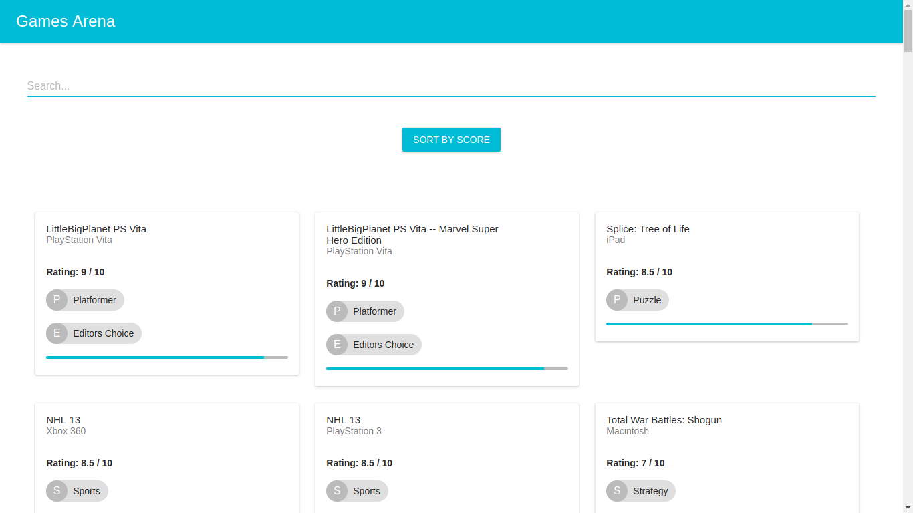
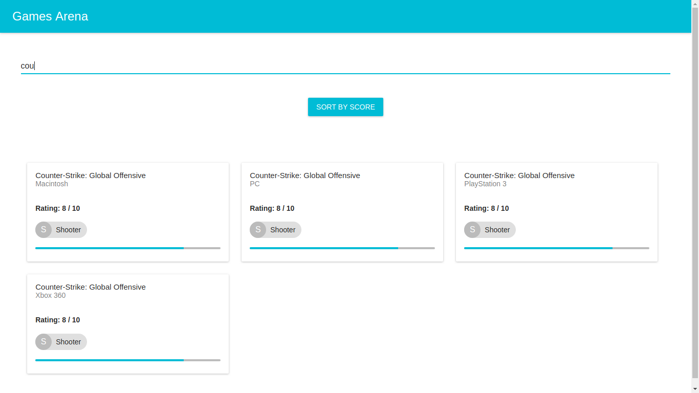
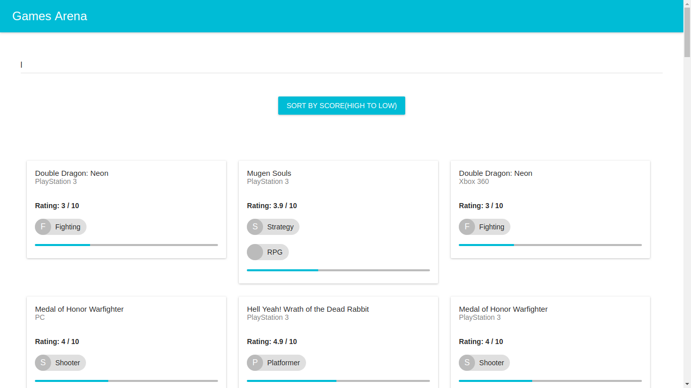
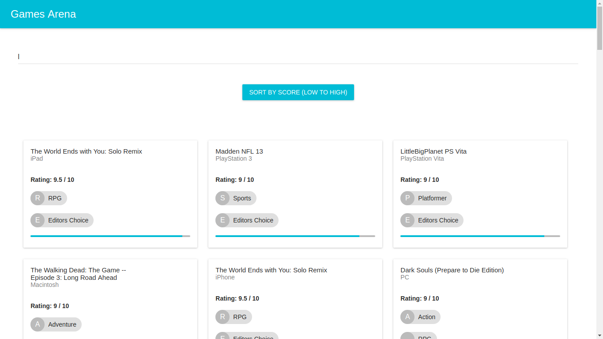
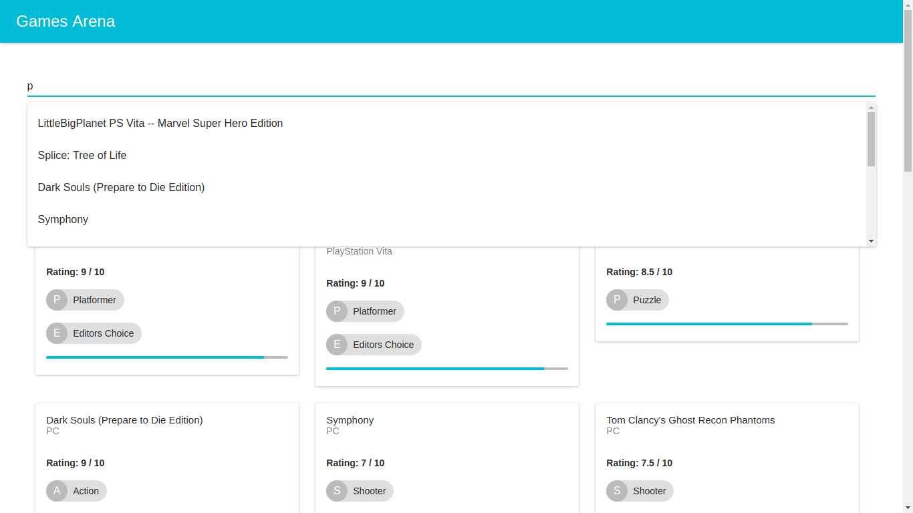
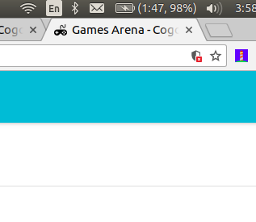
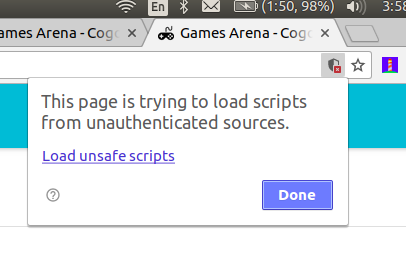

# Games-Arena | Cogoport Frontend Developer Hiring Challenge
Develop a pseudo front end application which would let the users help list and browse games developed for different platforms conveniently.

## How to run the project online
Open the online demo [here](https://manishbisht.github.io/Games-Arena)

## Features

- Use of Web API to fetch games details.
- Visually interactive responsive design listing all the games.
- Submit Screenshot, Source code & Instructions.
- A feature to Search (via name).
- Implement Sort feature (to filter through ‘score’ in ascending and descending order).
- Add autocomplete feature to Search games conveniently .
- Custom elegant design, fonts and icons to make web app more user-friendly.
- Use your imagination and add features which would make things easier for end users.

## Games API

- [http://starlord.hackerearth.com/gamesarena](http://starlord.hackerearth.com/gamesarena)

## How to run the project in Development Mode
The project uses [Node.js >= 6.x](https://nodejs.org/en/) and the [Create-React-App starter code](https://github.com/facebookincubator/create-react-app).

After Node is installed in your system, follow the below steps.

1. Navigate to the directory where you want to store the app.
2. Clone the repo `git clone https://github.com/manishbisht/Games-Arena.git`
3. Now install all modules listed as dependencies in `package.json` by running the command `npm install`
4. Launch the app with this command `npm start`

A new browser window open automatically displaying the app.  If it doesn't, navigate to [http://localhost:3000/](http://localhost:3000/) in your browser

***NOTE:*** *The service workers for this app will only cache the site when it is in production mode.*

## How to run the project in Production Mode

1. Build the production ready optimised code. `npm run build`
2. Deploy it to `gh-pages` branch by `npm run deploy`
3. Check the online demo [here](https://manishbisht.github.io/Games-Arena)

## Screenshots
Project Home Page

Search Feature

Sort by score (Low to high)

Sort by score (high to low)

Suggestions

My website manishbisht.me is https only so click on load the unsafe scripts while checking the demo as the GAMES API is HTTP only.

